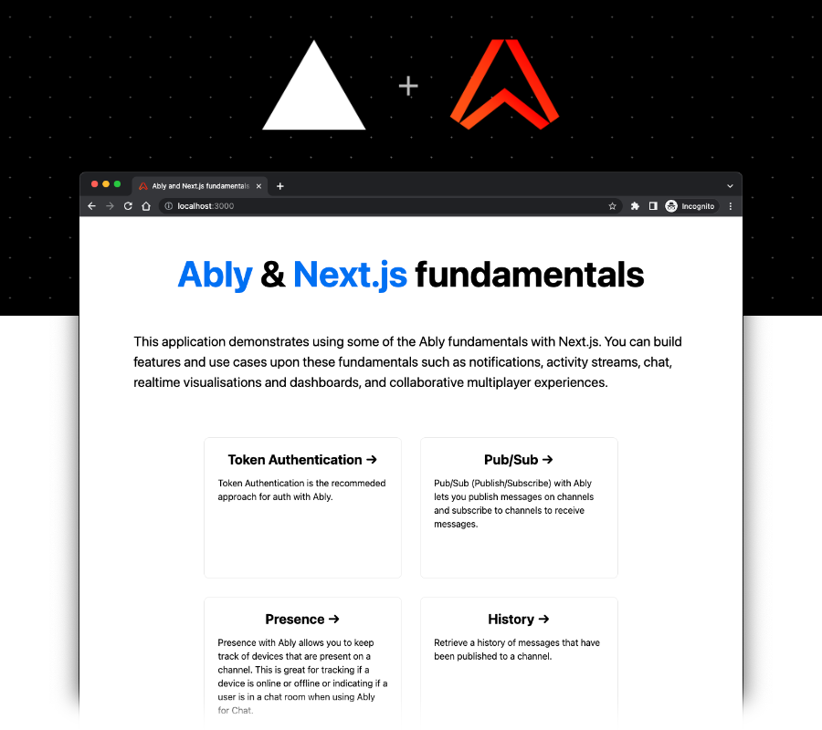

# Ably serverless WebSockets and Next.js fundamentals starter kit



## Description

This [Ably](https://ably.com?utm_source=github&utm_medium=github-repo&utm_campaign=GLB-2211-ably-nextjs-fundamentals-kit&utm_content=ably-nextjs-fundamentals-kit&src=GLB-2211-ably-nextjs-fundamentals-kit-github-repo) and [Next.js](https://nextjs.org) fundamentals starter kit demonstrates using some of the Ably's core functionality with Next.js. You can build features and use cases upon these fundamentals such as notifications, activity streams, chat, realtime visualisations and dashboards, and collaborative multiplayer experiences.

The Ably fundamentals demonstrated within this repo are:

- [Token Authentication](https://ably.com/docs/realtime/authentication?utm_source=github&utm_medium=github-repo&utm_campaign=GLB-2211-ably-nextjs-fundamentals-kit&utm_content=ably-nextjs-fundamentals-kit&src=GLB-2211-ably-nextjs-fundamentals-kit-github-repo#token-authentication) - authenticate and establish a persistent bi-direction connection to the Ably platform.
- [Pub/Sub (Publish/Subscribe)](https://ably.com/docs/realtime/channels?utm_source=github&utm_medium=github-repo&utm_campaign=GLB-2211-ably-nextjs-fundamentals-kit&utm_content=ably-nextjs-fundamentals-kit&src=GLB-2211-ably-nextjs-fundamentals-kit-github-repo) - publish messages on channels and subscribe to channels to receive messages.
- [Presence](https://ably.com/docs/realtime/presence?utm_source=github&utm_medium=github-repo&utm_campaign=GLB-2211-ably-nextjs-fundamentals-kit&utm_content=ably-nextjs-fundamentals-kit&src=GLB-2211-ably-nextjs-fundamentals-kit-github-repo) - keep track of devices that are present on a channel. This is great for tracking if a device is online or offline or indicating if a user is in a chat room when using Ably for Chat.
- [History](https://ably.com/docs/realtime/history?utm_source=github&utm_medium=github-repo&utm_campaign=GLB-2211-ably-nextjs-fundamentals-kit&utm_content=ably-nextjs-fundamentals-kit&src=GLB-2211-ably-nextjs-fundamentals-kit-github-repo) - Retrieve a history of messages that have been published to a channel.

The project uses the following components:

- [Next.js](https://nextjs.org), a flexible React framework that gives you building blocks to create fast web applications.
- [Ably](https://ably.com?utm_source=github&utm_medium=github-repo&utm_campaign=GLB-2211-ably-nextjs-fundamentals-kit&utm_content=ably-nextjs-fundamentals-kit&src=GLB-2211-ably-nextjs-fundamentals-kit-github-repo), for realtime messaging at scale.

## Building & running locally

### Prerequisites

1. [Sign up](https://ably.com/signup?utm_source=github&utm_medium=github-repo&utm_campaign=GLB-2211-ably-nextjs-fundamentals-kit&utm_content=ably-nextjs-fundamentals-kit&src=GLB-2211-ably-nextjs-fundamentals-kit-github-repo) or [log in](https://ably.com/login?utm_source=github&utm_medium=github-repo&utm_campaign=GLB-2211-ably-nextjs-fundamentals-kit&utm_content=ably-nextjs-fundamentals-kit&src=GLB-2211-ably-nextjs-fundamentals-kit-github-repo) to ably.com, and [create a new app and copy the API key](https://faqs.ably.com/setting-up-and-managing-api-keys?utm_source=github&utm_medium=github-repo&utm_campaign=GLB-2211-ably-nextjs-fundamentals-kit&utm_content=ably-nextjs-fundamentals-kit&src=GLB-2211-ably-nextjs-fundamentals-kit-github-repo).
2. To deploy to [Vercel](https://vercel.com), create a Vercel account.

### Configure the app

Create a `.env.local` file with your Ably API key:

```bash
echo "ABLY_API_KEY={YOUR_ABLY_API_KEY_HERE}">.env
```

### Run the Next.js app

```bash
npm run dev
# or
yarn dev
```

## Deploy on Vercel

The easiest way to deploy your Next.js app is to use the [Vercel Platform](https://vercel.com/new?utm_medium=default-template&filter=next.js&utm_source=create-next-app&utm_campaign=create-next-app-readme) from the creators of Next.js.

[](https://vercel.com/new/clone?repository-url=https%3A%2F%2Fgithub.com%2Fably-labs%2Fably-nextjs-fundamentals-kit&env=ABLY_API_KEY)

## Contributing

Want to help contributing to this project? Have a look at our [contributing guide](CONTRIBUTING.md)!

## More info

- [Join the Ably Discord server](https://discord.gg/q89gDHZcBK)
- [Follow Ably on Twitter](https://twitter.com/ablyrealtime)
- [Use the Ably SDKs](https://github.com/ably/)
- [Visit the Ably website](https://ably.com?utm_source=github&utm_medium=github-repo&utm_campaign=GLB-2211-ably-nextjs-fundamentals-kit&utm_content=ably-nextjs-fundamentals-kit&src=GLB-2211-ably-nextjs-fundamentals-kit-github-repo)

---
[](https://ably.com?utm_source=github&utm_medium=github-repo&utm_campaign=GLB-2211-ably-nextjs-fundamentals-kit&utm_content=ably-nextjs-fundamentals-kit&src=GLB-2211-ably-nextjs-fundamentals-kit-github-repo)